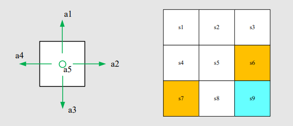
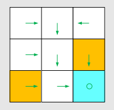
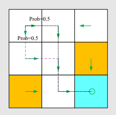
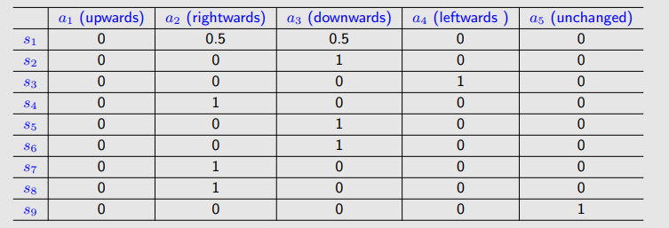
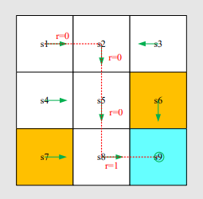
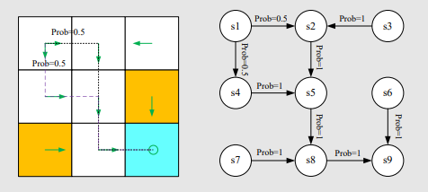
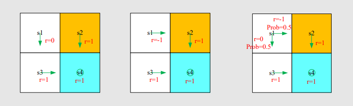
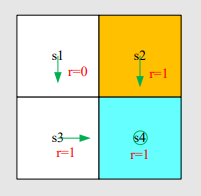

# 强化学习

# **Lecture 0 Introduction**

Basic concepts–>Bellman Equation–>Bellman Optimality Equation–>Value iteration/Policy iteration–>Monte Cario Learing（if no model )–> Stochastic Approximation–>Temporal-Difference Learing–>Value Funtion Approximation–>Policy Gradient Methods–>Actor-Crtic Methods

 **==强化学习的终极目标是求解最优策略==**

把握最优策略的概念：optimal policy /  optimal state value(利用Bellman optimality equation)

值和策略都在不停迭代，只是迭代的方式不同,计算state value的方式不同

**Value-based:**  $J(w)$是值函数,不断更新值函数的参数$w$,利用该值估计出来一个策略所对应的值

**Policy-based:**   $J(\theta)$是策略函数,不断更新策略函数参数 $\theta$ 相当于直接改变策略

**1.找目标函数**

**2.计算目标函数的梯度**

**3.梯度上升或梯度下降优化目标函数**

* Mathematical
* Systematic

# **Lecture 1 Basic  concepts**

## A grid-world example：

**State**: The ==status== of the agent with respect to the ==environment==

**State space**: the set of all states $S= \left\{ s_i\right\}^9_{i=1}$

**Action**: For each state, there are five possible actions: $a_1,···a_5$(即可采取的行动)

**Action space of a state**: $A\left\{ s_i\right\}=\left\{ a_i\right\}^5_{i=1}$(action space和状态是依赖的）

**State transition**: the agent may move from one state to another

eg: at state $s_1$, if take action  $a_2$
$$
s_1\xrightarrow{a_2}s_2
$$
***State transition defines the interaction with the environment.***（与环境交互）

**Forbidden area**: At state $s_5$, if we choose action $a_2$, the forbidden area is accessible but with penalty

**State transition probability**: use probability to describe state transition

- Intuition: At state $s_1$, if we choose action $a_2$ , the next state is $s_2$

- Math: (条件概率)
  $$
  \begin{aligned}
  &p(s_2\mid s_1, a_2)\\
  &p(s_i\mid s_1, a_2)=0\quad\forall_i \not=2
  \end{aligned}
  $$
  The state transition could be stochastic.（随机的）

**Policy**: tells the agent what actions to take at a state

Mathematical representation: using conditional probability.

eg: for state $s_1$
$$
\pi(a_1\mid s_1)=0\\
\pi(a_2\mid s_1)=1\\
\pi(a_3\mid s_1)=0\\
\pi(a_4\mid s_1)=0\\
\pi(a_5\mid s_1)=0\\
$$
针对一个状态，概率之和为1。

It’s a deterministic policy.

There are stochastic(随机的) policies:

for $s_1$:
$$
\pi(a_1\mid s_1)=0\\
\pi(a_2\mid s_1)=0.5\\
\pi(a_3\mid s_1)=0.5\\
\pi(a_4\mid s_1)=0\\
\pi(a_5\mid s_1)=0\\
$$

**Tabular representation** of a policy: how to use this table.

Can represent either ***deterministic*** or _**stochastic**_ cases.（编程的时候利用一个数组或一个矩阵代表一个策略）

实际当中执行策略：比如有0.5的概率是$a_2$, 0.5的概率是$a_3$, 编程实现：从0到1进行一个随机采样得到$x$（假设均匀分布），当$x\in$ 0~0.5采取 $a_2$, 当$x\in$ 0.5~1.0采取 $a_3$.

**Reward**: Reward is one of the most unique concepts of RL.

- A positive reward represents encouragement to take such actions. (正数鼓励)
- A negative reward represents punishment to take such actions. (负数惩罚）

Mathematical description: *conditional probability*

-  Intuition: At state $s_1$, if we choose action $a_1$, the reward is −1.

- Math: $p(r=-1\mid s_1, a_1)=1$ and $p(r\not=-1\mid s_1,a_1)=0$

**==The reward depends on the state and action, but not the next state.==** (for example, consider $s_1$, $a_1$ and $s_1$, $a_5$, 有相同的下一状态，但是reward不同).

reward实际上应该依赖于当前状态s、当前动作a，和下一个状态s'。但是这个可以化为p(r|s,a)条件概率

**Trajectory**: a **==state-action-reward==** chain
$$
s_1\xrightarrow[r=0]{a_2}s_2\xrightarrow[r=0]{a_2}s_5\xrightarrow[r=0]{a_3}s_8\xrightarrow[r=1]{a_2}s_9
$$

**Return**: the return of this trajectory is the sum of all the rewards collected along the trajectory
$$
return=0+0+0+1=1
$$
return可以用来评估不同策略的好坏.但是对于上述定义的return沿着无穷的轨迹加下去是无穷（发散），因此引入discount rate $\gamma\in[1,0)$

**Discounted return**:
$$
\begin{aligned}
discounted\quad return &=0+\gamma 0+\gamma^20+\gamma^31+\gamma^41+···\\
&=\gamma^3(1+\gamma+\gamma^2+···)
=\gamma^3\frac{1}{1-\gamma}
\end{aligned}
$$

-  the sum becomes finite
- If $\gamma$ is close to 0, the value of the discounted return is dominated by the rewards obtained *in the near future*.(高次方很快衰减，注重近的reward）
- If $\gamma$ is close to 1, the value of the discounted return is dominated by the rewards obtained in *the far future*.（注重长远reward）

**Episode**: When interacting with the environment following a policy, the agent may stop at some terminal states. The resulting trajectory is called an episode (or a trial).

An episode is usually assumed to be a finite(有限的) trajectory. Tasks with episodes are called ***episodic tasks***.

Some tasks may have no terminal states, meaning the interaction with the environment will never end. Such tasks are called ***continuing tasks***.

本课程中我们将episodic转换成continuing tasks：

- Option 1: Treat the target state as a special ***absorbing state***. Once the agent reaches an absorbing state, it will never leave. The consequent rewards $r=0$.
- Option 2: Treat the target state as a normal state with a policy. The agent can still leave the target state and gain $r=+1$ when entering the target state.

**We consider option 2 in this course so that we don’t need to distinguish the target state from the others and can treat it as a normal state.**（更加一般化，不区别对待目标）

## Markov decision process (MDP） 

> 这是一个框架

Key elements of MDP:

- **Sets:**
  - State: the set of states $S$
  - Action: the set of actions $A(s)$ is associated for state $ s ∈ S$.
  - Reward: the set of rewards $ R(s, a)$.
- **Probability distribution:**
  - State transition probability: at state $s$, taking action $a$, the probability to transit to state $s^,$ is $p(s^, |s, a)$
  - Reward probability: at state $s$, taking action $a$, the probability to get reward $r$ is $p(r\mid s,a)$
- **Policy**: at state $s$, the probability to choose action a is $\pi(a\mid )$
- ***Markov property: memoryless property***   (历史无关性)

$$
p(s_{t+1}\mid a_t,s_t,···,a_0,s_0)=p(s_{t+1}\mid a_{t+1},s_t)\\
p(r_{t+1}\mid a_t,s_t,···,a_0,s_0)=p(r_{t+1}\mid a_{t+1},s_t)\\
$$

All the concepts introduced in this lecture can be put in the framework in MDP.

M: Markov :Markov property

D: Decision: Policy

P: Process: Sets and probability distribution

The grid world could be abstracted as a more general model, ***Markov process***

The circles represent states and the links with arrows represent the state transition. *Markov decision process* becomes *Markov* process once the policy is given!

# **Lecture 2 Bellman Equation**

- **A core concept: state value**
- **A fundamental tool: the Bellman equation**

# 1. Motivating example

Policy 1, starting from $s_1$
$$
return_1=\frac{\gamma}{1-\gamma}
$$
Policy 2, starting from $s_1$
$$
return_2=-1+\frac{\gamma}{1-\gamma}
$$
Policy 2, starting from $s_1$
$$
return_3=0.5(-1+\frac{\gamma}{1-\gamma})+0.5(\frac{\gamma}{1-\gamma})\\
=-0.5+\frac{\gamma}{1-\gamma}
$$
In summary, starting from $s_1$
$$
return_1>return_2>return_3
$$
***Calculating return is important to evaluate a policy.***

**Calculate return**：

$$
v_1=r_1+\gamma(r_1+\gamma r_3+···)=r_1+\gamma v_2\\
v_2=r_1+\gamma(r_2+\gamma r_4+···)=r_2+\gamma v_3\\
v_3=r_1+\gamma(r_3+\gamma r_1+···)=r_3+\gamma v_4\\
v_4=r_1+\gamma(r_4+\gamma r_2+···)=r_4+\gamma v_5\\
$$
The returns rely on each other. ==***Bootstrapping***==

不同状态出发得到的return依赖于从其他状态出发得到的return.
$$
\left[
\begin{matrix}
v_1\\
v_2\\
v_3\\
v_4
\end{matrix}
\right]=\left[
\begin{matrix}
r_1\\
r_2\\
r_3\\
r_4
\end{matrix}
\right]+
\left[
\begin{matrix}
\gamma v_2\\
\gamma v_3\\
\gamma v_4\\
\gamma v_1
\end{matrix}
\right]=\underbrace{\left[
\begin{matrix}
v_1\\
v_2\\
v_3\\
v_4
\end{matrix}
\right]}_{\rm r}+\gamma 
\underbrace {\left[
\begin{matrix}
0&1&0&0\\
0&0&1&0\\
0&0&0&1\\
1&0&0&0
\end{matrix}
\right]}_{\rm P}
\underbrace{\left[
\begin{matrix}
v_1\\
v_2\\
v_3\\
v_4
\end{matrix}
\right]}_{\rm v}
$$

$$
\rm v=\rm r+\gamma P \rm v
$$

移项得：$(\rm I-\gamma \rm P)\rm v=\rm r$

其中 $\rm I$ 是单位矩阵，将 $(\rm I-\gamma \rm P)$ 求逆再与 $\rm r$ 相乘，即可得到 $\rm v$ .

***This is the Bellman equation (for this specific deterministic problem)!!***

- Though simple, it demonstrates the core idea: **the value of one state relies on the values of other states. **（*Bootstrapping*思想)
-  A matrix-vector form is more clear to see how to solve the state values.

***Exercise:***

***Answer:***
$$
v_1=0+\gamma v_3\\
v_2=1+\gamma v_4\\
v_3=1+\gamma v_4\\
v_4=1+\gamma v_4
$$

# 2. State value

Single-step process:

$S_t$

# 3. Bellman equation: Derivation(推导)

# 4.  Bellman equation: Matrix-vector form（矩阵向量形式）

# 5. Bellman equation: Solve the state values

# 6. Action value

# 7.Summary
